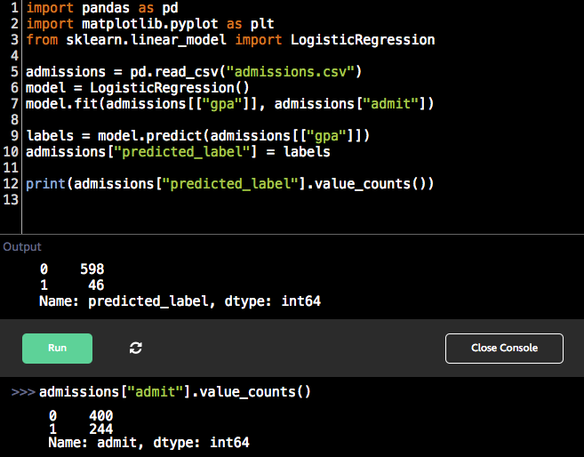
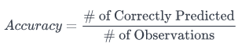
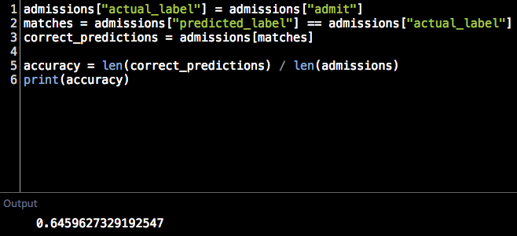
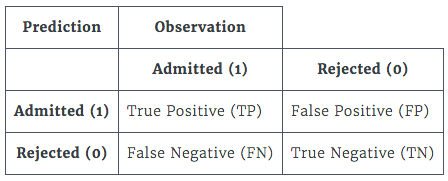
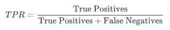
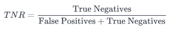
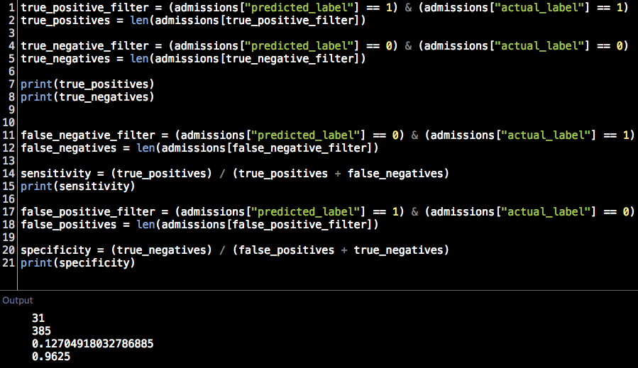
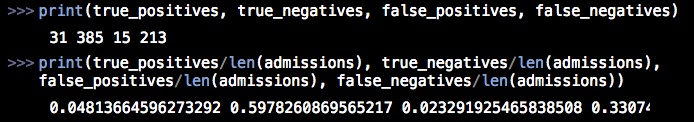

== Introduction to evaluating binary classifiers

 * Introduction to the Data
   ** 이전장에서 분류, 로지스틱 회귀에 대해 학습함
   ** 중복이지만 데이터에 대한 설명 (644개의 데이터)
      *** GRE - 신청자의 Graduate Record 시험 점수, 예비 대학원생을위한 일반 시험 (200 ~ 800)
      *** GPA - 대학 학점 평균 (0.0 ~ 4.0)
      *** ADMIT - 이진 값으로 1은 합격, 0은 불합격을 나타냄
   ** 이전장 처럼 GPA 를 이용하여 살펴봄
   ** 

 * Accuracy (예측 정확도)
   ** 분류 모델 (Logistic Regression) 에서의 효율성을 결정하는데에 가장 간단한 방법은 예측 정확도를 이용한다.
   ** 예측 정확도는 정확하게 예측한 갯수를 전체 갯수로 나누어 값을 결정한다.
   ** 
   ** 
   ** 로지스틱 회귀 분석에서의 결과는 0 과 1 사이의 확률로 표현됨
   ** 따라서, 이 값을 근거로 분류하기 위해 특정 기준을 잡고, 그 값보다 확률이 높으면 1, 그렇지 않으면 0 으로 표출한다.
   ** 이때 기준으로 삼은 값을 discrimination threshold (판별 임계값?) 이라고 한다
   ** scikit-learn 에는 기본으로 0.5 가 셋팅되어 있음

 * Binary classification outcomes
   ** 위에서의 정확도 64.6% 는 무작위로 추출하는것 (약 50%) 보다는 나아 보임
   ** train 셋에서의 모델 정확도를 계산하는것은
   ** 위에서 확인한 예측 정확도는 훈련되지 않은 데이터셋 에 대해서는 어떻게 모델이 수행될지 알 수 없음
   ** 훈련 셋을 이용한 평가에서 100% 정확도를 반환하는 모델 역시 이전에 학습되지 않은 새로운 데이터 셋에 대해서는 얼마나 효과가 있을지 모름
   ** 따라서, 위에서 학습한 단순한 예측 정확도보다 좀 더 모델의 효과를 테스트 하고, 평가할 수 있는 원칙에 대해 학습
   ** 위에서 예측한 결과를 이용하여 아래와 같이 분류를 해 보면.. (대학원 합격 여부)
   ** 
      *** True Positive : 예측 - 합격, 실제 - 합격
      *** True Negative : 예측 - 불합격, 실제 - 불합격
      *** Flase Positive : 예측 - 합격, 실제 - 불합격
      *** False Negative : 예측 - 불합격, 실제 - 합격
   ** True / False : 예측과 실제가 같은 경우 True, 그렇지 않은 경우 False
   ** Positive / Negative : 예측이 1(합격) 인 경우 Positive, 0(불합격) 인 경우 Negative

 * Sensitivity (True Positive Rate, 민감성)
   ** 위에서 이야기 되었던 간단한 예측 정확도보다 훨씬 통찰력있는 몇 가지 방법에 대한 학습
   ** Sensitivity(민감도?) 또는 TPR(진정한 1의 비율?)...
   ** 
   ** 대학원 입학 샘플을 기준으로 설명하면... 인합격했어야 하는 전체 인원 대비 모델 예측과 실제로도 합격한 인원의 비율
   ** 위의 값이 낮은 경우 해당 모델은 긍정적(1)인 경우를 예측하는데 효과적이지 않음을 의미
   ** High Sensitive Model : 상황에 따라서 Sensitivity 또는 TPR 이 높아야 하는 케이스가 있음 (예를들면 암환자 포착 등)
   ** 위의 결과에서 12.7% 라고 하면 상당히 낮은 값이긴 하지만 상황에 따라서는 나쁘지 않을 수도 있음
   ** 우리가 살펴보는 대학원 입학의 경우 합격 가능한 8명중 1명만을 제대로 예측했다는 말이지만 학교 입장에서는 좀 더 강화된(?) 기준을 적용한 것으로 볼 수 있음
   ** 하지만, 상황에 따라 암환자를 판단하는 케이스라고 하면 암환자 일 수 있는 나머지 7명을 제대로 파악하지 못한게 되므로 안좋은 모델이 됨

 * Specificity (True Negative Rate, 특이성)
   ** 이번에 배우는 항목은 특이성으로 위에서 학습한 TPR 대신 TNR 이라고 도 함
   ** 위에서 살펴본 대학원 입학 관련 케이스에 맞추어 보면... 탈락했어야 하는 전체 인원 대비 모델 예측과 실제로도 탈락한 인원의 비율
   ** High Specificity 란 해당 모델이 Reject 를 잘 예측했다는것을 의미함
   ** 
   ** 계산된 값에 의하면 특이성은 96.25% 임, 민감도와 마찬가지로 특이성도 Reject 할 대상을 정확히 Reject 해야 하는 케이스에서는 중요한 요소임
   ** 
   ** 

 * Next steps
   ** 다음 미션에서는 Cross-Validation(교차검증)에 대해 학습
   ** 훈련되지 않은 새로운 데이터에 대한 모델 정확성 평가
   ** 판별(?) 임계값을 변경 하는것이 어떤 영향을 미치는지에 대한 학습
   ** 이런 기술들을 학습함으로써 분류모델에 대한 성능을 완벽히(?) 이해 할 수 있음

== 활용 주요 function
 * import pandas as pd
 * from sklearn.linear_model import LogisticRegression

 * function
   ** admissions = pd.read_csv("admissions.csv")
   ** model = LogisticRegression()
   ** model.fit(admissions[["gpa"]], admissions["admit"])
   ** labels = model.predict(admissions[["gpa"]])
