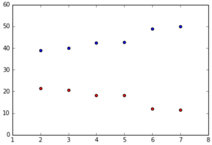

== Overfitting

 * Introduction
   ** Overfitting 을 피하기 위한 방법에 대한 학습
   ** 지난번 자동차 원산지에 대한 분류 회귀에서 사용한 데이터를 이용

 * Bias and Variance
   ** Overfitting 은 bias 와 variance 를 이해해야 함
   ** bias 는 학습 알고리즘에 대한 잘못된 가정을 초래하는 오류를 설명함 (전체적으로 치우침 정도)
   ** variance 는 모델의 예측값의 다양성에 의해 발생하는 오류를 설명함 (흩어짐 정도)
   ** 이상적인 상황에서는 낮은 bias 와 낮은 variance 를 원하지만 실제로는 그렇지 않음

 * Bias-variance tradeoff
   ** 모든 프로세스에는 noise 가 존재하며 Overfitting 된 모델은 noise 를 포착하는 경향이 있음
   ** 동일한 데이터 세트에서 서로 다른 Feature 를 이용하여 선형회귀 모델을 학습하고 절대오차 평균제곱오차 또는 R-Squared 를 계산하여 bias를 추정할 수 있음
   ** image:http://i.imgur.com/2xqTu46.png[]

 * Multivariate models
   ** 다양한 Feature 에 대한 모델들에 대해 mse 와 variance 를 계산

 * cross validation
   ** 모델이 Overfitting 인지 확인하는데 있어서는 Train Set 과 Test Set 간의 오류를 비교
   ** out-of-sample error : 테스트 셋을 이용한 모델로 분석
   ** test 셋티 없는 경우 교차 유효성 검사를 사용 (Cross Validation)
   ** 샘플에 대한 오류 보다 샘플 외부 오류(테스트 셋) 가 크면 Overfitting 으로 판단할 수 있음

 * Plotting cross-validation error vs. cross-validation variance
   ** 교차 유효성 검사 중 모델에 추가된 Feature 가 많을 수록 mse 가 낮아짐
   ** 이런 케이스는 설정한 모델이 새로운 데이터셋에도 잘 적용될 수 있는 일반화가 되어 있음을 나타냄
   ** 대신 예측된 분산값이 커지게 됨 (따라서, bias 와 variance 간 trade off 가 필요함)
   ** red : mse, blue : variance
   ** 
 * Conclusion
   ** 고차원 다변량 모델은 저차원 다변량 모델과 관련해서 Overfit 되는 경향이 있음 (?)
   ** 하지만 in-sample-error 와 out-of-sample-error 의 편차는 크지 않음 (?)
   ** 모델의 복잡성이 증가하면 전체 분산이 커지게 됨

 * Next steps
   ** 다음 미션에서는 K-means clustering 에 대해서 학습

== 활용 주요 function
 * import pandas as pd
 * from sklearn.linear_model import LinearRegression
 * from sklearn.metrics import mean_squared_error

 * function
   ** lr = LinearRegression() : 선형 회귀 모델 설정
   ** lr.fit(features, target) : 셋팅
   ** predictions = lr.predict(features) : 예측
   ** mean_squared_error(filtered_cars["mpg"], predictions) : mse 계산
   ** np.var(predictions) : variance 계산
   ** 튜플 형태로 리턴시 return(mse, variance)
      *** cyl_mse, cyl_var = train_and_test(["cylinders"]) 의 형식으로 받을 수 있음
      *** weight_mse, weight_var = train_and_test(["weight"]) 의 형식으로 받을 수 있음
