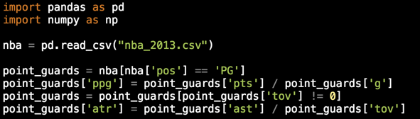
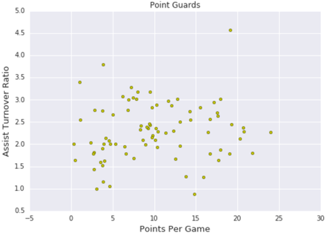
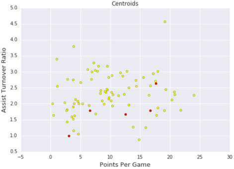
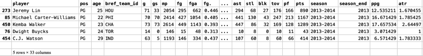
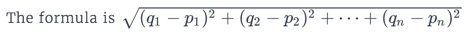
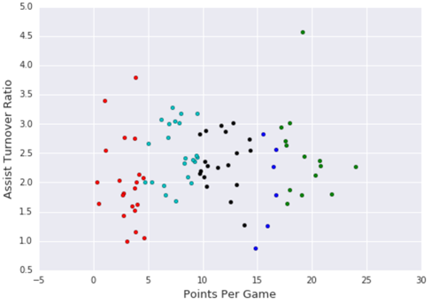
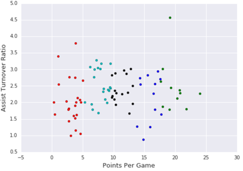
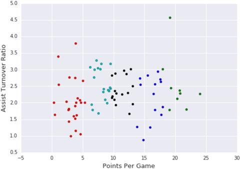
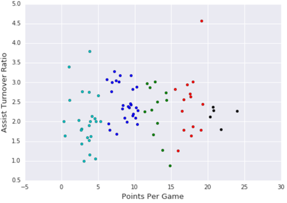

== K-Means Clustering

 * Clustering NBA Players
   ** NBA 매체에서는 주로 특정 선수들에 대한 기록, 특출함에 대한 이야기를 보도
   ** 데이터 과학의 관점에서 이에 대한 분석을 진행해 봄

 * Point Guards
   ** 포인트가드 : 팀의 득점 기회를 만들어내는 역할을 하는 플레이어로 가장 중요한 역할을 담당함 (pos 필드에 PG 로 표시됨)
   ** 포인트 가드의 경우 어시스트와 TOR (turnover ratio) : 실책률 로 평가 됨
   ** 플레이어가 만들어낸 점수 생성의 기회를 정량화 하는 지표

 * Point Per Game
   ** 게임당 포인트에 해당하는 필드는 득점 포인트를 게임수로 나누어서 생성함

 * Assist Turnover Ratio
   ** Turnover 가 0 인 값을 제외
   ** ATR 은 Assist 수를 Turnover 인 실책으로 나눈 값을 나타냄
   ** 

 * Visualizing the Point Guards
   ** X 축 : Point Per Game, Y 축 : Assist Turnover Ratio
   ** 
----
   plt.scatter(point_guards['ppg'], point_guards['atr'], c='y')
   plt.title("Point Guards")
   plt.xlabel('Points Per Game', fontsize=13)
   plt.ylabel('Assist Turnover Ratio', fontsize=13)
   plt.show()
----

 * Clustering players
   ** 여러 클러스터링 방법 중 Centroid 기반 Clustering 에서 중심은 해당 클러스터 내의 모든 데이터의 산술 평균으로 구함
   ** Centroid 기반 클러스터링은 클러스터가 중심에 있고 원과 유사 할 때 잘 작동
   ** K-Means Clustering은 우리가 사용하는 인기있는 중심 기반 클러스터링 알고리즘
   ** K-Means에서 K는 데이터를 분류 할 클러스터의 수를 나타냄
   ** K-Means (그리고 대부분의 감독되지 않은 기계 학습 기술)의 핵심 부분은 k가 무엇인지를 지정해야한다는 것이며 여기에는 장단점이 있지만 장점은 유스 케이스에 가장 적합한 k를 선택할 수 있다는 점
   ** 우리 예제에서는 K-Means가 데이터를 5 개의 클러스터로 나누기를 원하기 때문에 k를 5로 설정

 * The Algorithm
   ** K-Means 설정은 각 클러스터의 중심과 해당 클러스터에 속한 플레이어의 재 계산 사이를 전환하는 반복 알고리즘
   ** 시작하려면 5 명의 플레이어를 무작위로 선택하고 좌표를 방금 생성 한 클러스터의 초기 중심으로 지정
   ** 1 단계 (클러스터에 포인트 할당)
      *** 각 플레이어에 대해 해당 플레이어의 좌표 또는 atr & ppg 값과 각 중심 좌표 간의 유클리드 거리를 계산합니다.
      *** 중심 값이 플레이어의 값과 가장 가까운 유클리드 거리가 가장 가까운 클러스터에 플레이어를 할당합니다.
   ** 2 단계 (클러스터의 새로운 중심 업데이트)
      *** 각 클러스터에 대해 해당 클러스터의 모든 포인트 (플레이어)의 산술 평균을 계산하여 새 중심을 계산
      *** 산술 평균은 모든 X 값 (atr)의 평균과 해당 클러스터의 모든 Y 값 (ppg)의 평균을 취하여 계산합니다.
   ** 클러스터가 더 이상 움직이지 않고 수렴 할 때까지 1 단계와 2 단계를 반복
----
   num_clusters = 5
   random_initial_points = np.random.choice(point_guards.index, size=num_clusters)
   centroids = point_guards.loc[random_initial_points]
----

 * Visualize Centroids
----
   plt.scatter(point_guards['ppg'], point_guards['atr'], c='yellow')
   plt.scatter(centroids['ppg'], centroids['atr'], c='red')
   plt.title("Centroids")
   plt.xlabel('Points Per Game', fontsize=13)
   plt.ylabel('Assist Turnover Ratio', fontsize=13)
   plt.show()
----
   ** 

 * Setup (continued)
   ** 위에서 centroids 로 선정한 dataframe 구조를 좀 더 계산에 적합하게 ID, PPG 와 ATR 를 가지는 dictionary 구조로 변경
   ** 
----
   def centroids_to_dict(centroids):
     dictionary = dict()
     counter = 0

     # iterate a pandas data frame row-wise using .iterrows()
     for index, row in centroids.iterrows():
       coordinates = [row['ppg'], row['atr']]
       dictionary[counter] = coordinates
       counter += 1

     return dictionary
----

 * Step 1 (Euclidean Distance)
   ** 유클리드 거리 (Euclidean distance)는 벡터 사이의 거리를 측정하기위한 데이터 과학에서 사용되는 가장 일반적인 기법
   ** 2 차원 및 3 차원에서 매우 잘 작동
   ** 더 높은 차원에서 유클리드 거리는 잘못된 값을 도출 할 수 있으며, 2 차원에서 유클리드 거리는 본질적으로 피타고라스의 정리를 따름
   ** 정규화 ???
   ** 
----
   import math

   def calculate_distance(centroid, player_values):
     root_distance = 0

     for x in range(0, len(centroid)):
       difference = centroid[x] - player_values[x]
       squared_difference = difference**2
       root_distance += squared_difference

     euclid_distance = math.sqrt(root_distance)

     return euclid_distance
----

 * Step 1 (Continued)
   ** 전체 데이터에 대해 유클리드 거리를 이용하여 분류함
----
   def assign_to_cluster(row):
     lowest_distance = -1
     closest_cluster = -1

     for cluster_id, centroid in centroids_dict.items():
       df_row = [row['ppg'], row['atr']]
       euclidean_distance = calculate_distance(centroid, df_row)

       if lowest_distance == -1:
         lowest_distance = euclidean_distance
         closest_cluster = cluster_id
       elif euclidean_distance < lowest_distance:
         lowest_distance = euclidean_distance
         closest_cluster = cluster_id

     return closest_cluster
----

 * Visualizing Clusters
   ** 
----
   def visualize_clusters(df, num_clusters):
     colors = ['b', 'g', 'r', 'c', 'm', 'y', 'k']

     for n in range(num_clusters):
       clustered_df = df[df['cluster'] == n]
       plt.scatter(clustered_df['ppg'], clustered_df['atr'], c=colors[n-1])
       plt.xlabel('Points Per Game', fontsize=13)
       plt.ylabel('Assist Turnover Ratio', fontsize=13)
     plt.show()

visualize_clusters(point_guards, 5)
----

 * Step 2

----
   # Centroid 재계산 함수
   def recalculate_centroids(df):
     new_centroids_dict = dict()

     for cluster_id in range(0, num_clusters):
       values_in_cluster = df[df['cluster'] == cluster_id]
       new_centroid = [np.average(values_in_cluster['ppg']), np.average(values_in_cluster['atr'])]
       new_centroids_dict[cluster_id] = new_centroid
     return new_centroids_dict
----

 * Repeat Step 1
   ** 

 * Repeat Step 2 and Step 1
   ** 

 * Challenges of K-Means
   ** 1 단계와 2 단계를 반복하고 visualize_clusters를 실행하면 클러스터가 겹치는 영역에서 몇 가지 포인트가 클러스터를 변경한다는 것을 알 수 있음
   ** K-Means는 반복시 클러스터 구성이 크게 변경되지는 않고, 안정적으로 수렴함을 알 수 있음
   ** K-Means는 반복시 위결과 처럼 크게 변경되지 않으므로 초기 중심점 선택과 클러스터링 하는 기준(방법)을 정하는게 중요함
   ** 이러한 문제를 해결하기 위해 K-Means의 sklearn 구현은 임의의 초기 중심을 사용
   ** 
----
   from sklearn.cluster import KMeans

   kmeans = KMeans(n_clusters=num_clusters)
   kmeans.fit(point_guards[['ppg', 'atr']])
   point_guards['cluster'] = kmeans.labels_

   visualize_clusters(point_guards, num_clusters)
----

 * Conclusion
   ** 이번 학습에서 비슷한 특성을 가진 그룹으로 NBA 선수를 분류하는 방법에 대해 학습
   ** 우리의 탐험은 각 플레이어의 Assist Turnover Ratio와 Points Per Game에 따라 5 가지 포인트 가드 감각을 얻는 데 도움이되었습니다.
   ** 다음 장에서는 Centroids 들을 사용하지 않고 데이터를 클러스터링하는 방법과 더 많은 Feature 를 사용하여 클러스터하는 방법에 대해 학습
   ** sklearn에서는 간단하게 K-means 를 구현해 주므로 많이 이용하자 !
   ** 참고 : https://ko.wikipedia.org/wiki/K-%ED%8F%89%EA%B7%A0_%EC%95%8C%EA%B3%A0%EB%A6%AC%EC%A6%98

 * K-Means 특징
   ** 초기화 기법
      *** 무작위 분할 (Random Partition)
          **** 무작위 분할 알고리즘은 가장 많이 쓰이는 초기화 기법
          **** 각 데이터들을 임의의 클러스터에 배당한 후, 각 클러스터에 배당된 점들의 평균 값을 초기 클러스터로 설정
          **** 데이터 순서에 대해 독립적
          **** 무작위 분할의 경우 초기 클러스터가 각 데이터들에 대해 고르게 분포되기 때문에 각 초기 클러스터의 무게중심들이 데이터 집합의 중심에 가깝게 위치하는 경향이 있음
          **** 이러한 특성 때문에 K-조화 평균이나 퍼지 K-평균에서는 무작위 분할이 선호됨
      *** Forgy
          **** Forgy 알고리즘은 1965년 Forgy에 의해 고안되었으며 현재 주로 쓰이는 초기화 기법 중 하나
          **** 데이터 집합으로부터 임의의 k개의 데이터를 선택하여 각 클러스터의 초기로 설정
          **** 무작위 분할 기법과 마찬가지로 Forgy 알고리즘은 데이터 순서에 대해 독립적
          **** Forgy 알고리즘의 경우 초기 클러스터가 임의의 k개의 점들에 의해 설정되기 때문에 각 클러스터의 무게중심이 중심으로부터 퍼져있는 경향
          **** 이러한 특성 때문에 EM 알고리즘이나 표준 K-평균 알고리즘에서는 Forgy 알고리즘이 선호됨
      *** MacQueen
          1967년 MacQueen에 의해 고안된 MacQueen 알고리즘은[2] Forgy 알고리즘과 마찬가지로 데이터 집합으로 부터 임의의 k개의 데이터를 선택하여 각 클러스터의 초기값으로 설정
          **** 이후 선택되지 않은 각 데이터들에 대해, 해당 점으로부터 가장 가까운 클러스터를 찾아 데이터를 배당한다.
          **** 모든 데이터들이 클러스터에 배당되고 나면 각 클러스터의 무게중심을 다시 계산하여 초기 {\displaystyle \mu _{i}} {\displaystyle \mu _{i}}로 다시 설정한다.
          **** MacQueen 알고리즘의 경우 최종 수렴에 가까운 클러스터를 찾는 것은 비교적 빠르나, 최종 수렴에 해당하는 클러스터를 찾는 것은 매우 느림
      *** Kaufman
          **** 1990년에 Kaufman과 Rousseeuw에 의해 고안됨
          **** 전체 데이터 집합 중 가장 중심에 위치한 데이터를 첫번째로 설정한다.
          **** 이후 선택되지 않은 각 데이터들에 대해, 가장 가까운 무게중심 보다 선택되지 않은 데이터 집합에 더 근접하게 위치한 데이터를 또 다른 클러스터 중심으로 설정
          **** 위의 방식을 총 k개의 클러스터 중심이 설정될 때 까지 반복
          **** 무작위 분할과 마찬가지로, Kaufman 알고리즘은 초기 클러스터링과 데이터 순서에 대해 비교적 독립적이기 때문에 해당 요소들에 의존적인 다른 알고리즘들 보다 월등한 성능을 보임
   ** 적절한 k 값은 ?
      *** Rule Of Thumb
          **** sqrt( n / 2 )
          **** ex) sqrt( 85 / 2 ) = 6.519202405
      *** Elbow Method : 클러스터 수를 늘려가면서 확인하다 더 좋아지지 않을때 그 이전 값을 설정하는 방식
      *** Information Criterion Approach
          **** 클러스터링 모델에 대해 가능도를 계산하는 것이 가능할 때 이를 이용하여 정보 기준값을 설정하여 사용하는 방법
          **** 통계학에서, 가능도(可能度, 영어: likelihood) 또는 우도(尤度)는 확률 분포의 모수가, 어떤 확률변수의 표집값과 일관되는 정도를 나타내는 값
          **** 구체적으로, 주어진 표집값에 대한 모수의 가능도는 이 모수를 따르는 분포가 주어진 관측값에 대하여 부여하는 확률
   ** 한계점
      *** 클러스터 개수 K값을 입력 파라미터로 지정해주어야 함
          **** K가 적을때
          image:https://upload.wikimedia.org/wikipedia/commons/thumb/f/f9/Kmeans_wrongK.PNG/440px-Kmeans_wrongK.PNG[]
          **** K가 많을때
          image:https://upload.wikimedia.org/wikipedia/commons/thumb/2/2f/Kmeans_toomany.PNG/440px-Kmeans_toomany.PNG[]
      *** 알고리즘의 에러 수렴이 전역 최솟값이 아닌 지역 최솟값으로 수렴할 가능성이 있다
          **** image:https://upload.wikimedia.org/wikipedia/commons/thumb/7/7f/Kmeans_wronginit1.PNG/440px-Kmeans_wronginit1.PNG[]
          **** image:https://upload.wikimedia.org/wikipedia/commons/thumb/a/a9/Kmeans_wronginit2.PNG/440px-Kmeans_wronginit2.PNG[]
      *** 이상값 (outlier) 에 민감함
          **** image:https://upload.wikimedia.org/wikipedia/commons/thumb/d/d7/Kmeans_outlier.PNG/440px-Kmeans_outlier.PNG[]
      *** 구형 (spherical) 이 아닌 클러스터를 찾는 데에는 적절하지 않다.
          **** image:https://upload.wikimedia.org/wikipedia/commons/thumb/4/42/Kmeans_nonspherical.PNG/440px-Kmeans_nonspherical.PNG[]

== 활용 주요 function
 * point_guards['cluster'] = point_guards.apply(lambda row: assign_to_cluster(row), axis=1)
   ** centroids_dict
     { 0: [12.535211267605634, 1.6704545454545454],
       1: [16.67142857142857, 1.785425101214575],
       2: [17.65753424657534, 2.6449704142011834],
       3: [3.0714285714285716, 1.0],
       4: [6.571428571428571, 1.7833333333333334] }
   ** centroids_dict.items()
      dict_items(
        [(0, [12.535211267605634, 1.6704545454545454]),
         (1, [16.67142857142857, 1.785425101214575]),
         (2, [17.65753424657534, 2.6449704142011834]),
         (3, [3.0714285714285716, 1.0]),
         (4, [6.571428571428571, 1.7833333333333334])])
