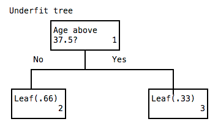

== Applying Decision Trees

 * Introduction to the Data Set
   ** 지난 두 가지 미션에서 Decision Tree 가 어떻게 구성되는지 학습
   ** 가장 일반적인 트리 생성 알고리즘인 C4.5와 CART보다 약간 단순한 ID3의 수정 된 버전을 사용 (기본 사항은 동일
   ** 이번 미션에서는 Decision Tree 를 언제 사용해야하는지와 가장 효과적으로 사용하는 방법에 대해 학습
   ** 이전 미션에서 사용했던 미국 수입에 대한 1994 년 인구 조사 자료를 계속 사용하며 결혼상태, 나이, 직장유형과 high_income 필드를 사용
   ** high_income 은 연간 50k 이하 (0) 또는 연간 50k 이상 (1)의 소득을 나타냄

 * Using Decision Trees With scikit-learn
   ** scikit-learn 패키지를 사용하여 Decision Tree 를 진행
   ** 분류 문제에는 DecisionTreeClassifier 클래스를 사용하고 회귀 문제에 대해서는 DecisionTreeRegressor를 사용
   ** sklearn.tree 패키지에는이 두 클래스가 모두 포함되어 있으며, 이 경우에는 바이너리 결과를 예측하므로 분류 기준을 사용

 * Splitting the Data into Train and Test Sets
   ** 모델을 정의했으므로 알고리즘을 훈련하기 위한 훈련셋을 설정
   ** 전체 데이터를 훈련셋으로 하는 경우 Overfitting 이 될 수 있으므로 적절히 훈련셋과 테스트셋으로 나누어 진행
   ** 예제에서는 데이터를 랜덤하게 섞은 후 훈련셋과 테스트셋을 분리함 (80 : 20)

 * Evaluating Error With AUC
   ** 분류를 통해 오류를 평가하는 방법은 많이 있지만, 우리는 이미 기계 학습 자료에서 폭넓게 다루고있는 AUC를 사용
   ** AUC의 범위는 0에서 1까지이므로 이진 분류에 이상적이며, AUC가 높을수록 예측치가 정확 해짐
   ** sklearn.metrics의 roc_auc_score 함수로 AUC를 계산할 수 있음
   ** ROC Curve (Receiver Operating Characteristic Curve)
      *** ROC 분석은 원래 신호감지이론(Signal Dectection Theory) 의 한 분야로, 세계2차대전 당시 레이더가 감지한 신호가 적함 혹은 아군함을 나타내는 것인지 아니면 단순한 잡음(Noise)인지를 판별하는데 사용
      *** 레이더를 수신(Receiver Operating)하는 수신기의 특성(Characteristic)을 요약하여 보여준다는 점에 착안하여 ROC라는 이름이 부여됨
      *** 위양성율(1-특이도; X축)과 그에 대한 실제 양성률(민감도 또는 1-위음성률; Y축)을 그래프로 표현한 것
      *** FPR (Flase Positive Rate, 1-Specificity 특이도, x축)
      *** TPR (True Positive Rate, Sensitivity 민감도, y축)
   ** AUC (Area Under the Curve)
      *** ROC 커브의 아래쪽 면적을 나타내며, 0~1 사이의 값을 가짐
      *** 값이 클수록 정확한 모델을 의미
      *** AUC 수치에 따라 비정보적(AUC=0.5), 덜 정확한(0.5<AUC≤0.7), 중등도의 정확한(0.7<AUC≤0.9), 매우정확한(0.9<AUC<1) 그리고완벽한검사(AUC=1)로 분류
      *** 그려진 curve가 좌측 위쪽 모서리에 가까울수록 좀 더 정확한 검사법이라고 해석할 수 있으며, 실제 양성률은 높고 위양성률은 낮음을 의미함
   ** image:http://postfiles15.naver.net/20161003_142/hancury_14754767322116D7m7_PNG/ROC.PNG?type=w2[]

 * Computing Error on the Training Set
   ** 테스트셋의 예측에 대한 AUC는 약 0.694
   ** 모델의 Overfitting 여부를 확인하기 위해 훈련셋에 대한 예측에 대해 AUC와 비교해 보면 훈련셋의 AUC 인 0.947 에 비해 낮음
   ** 모델이 테스트셋보다 훈련셋을 더 잘 예측하는 것은 정상
   ** 훈련셋에 대한 예측과 실제 값 사이의 AUC가 테스트셋 예측과 실제 값 사이의 AUC보다 상당히 높으면 모형이 Overfitting 되어 있음을 나타냄
   ** 

 * Decision Tree Overfitting
   ** 위에서 본 것 처럼 훈련셋과 테스트셋을 구분하는것으로는 Overfitting 을 해결할 수 없음
   ** 이전 미션에서의 데이터로 예를 들어보면..
   ** 
   ** 위의 의사결정 트리의 경우 훈련셋에 특화 되어 있음
   ** 이를 실세계를 기준으로 다시 트리를 합리적으로 만들어 보면..
   ** 
   ** 위의 의사결정 트리는 훈련셋에 대한 정확도는 낮지만 좀 더 현실과 가까운 예측이 가능해 짐
   ** 훈련셋과 잘 매칭되는 너무 깊은 뎁스와 복잡한 룰을 가지는 OverFit 된 Tree 는 일반화된 새로운 데이터에는 잘 맞지 않음
   ** 이것은 이상한 것 처럼 보일지 모르겠지만 트리가 깊어지고 복잡해질 수록 새로운 데이터셋에 대해서는 일반적으로 더 나쁜 영향을 미치게 됨

 * Reducing Overfitting With a Shallower Tree
   ** Overfitting 을 제거하기 위한 방법
      *** 불필요한 leaves 를 제거
      *** 상상블 기법?을 이용하여 여러개의 의사결정 트리를 혼합하여 사용
      *** 나무의 깊이를 제한하여 트리를 생성 (예제)
   ** DecisionTreeClassifier 클래스 초기화시 몇개의 매개변수를 추가하여 깊이를 제한 할 수 있음
   ** 모델의 복잡성이 증가하면 전체 분산이 커지게 됨
   ** max_depth - 트리가 갈 수있는 깊이를 전역 적으로 제한합니다.
   ** min_samples_split - 분할되기 전에 노드에 있어야하는 최소 행 수. 예를 들어 2로 설정하면 2 행이있는 노드가 분할되지 않고 대신 잎이됩니다.
   ** min_samples_leaf - 리프가 가져야하는 최소 행 수
   ** min_weight_fraction_leaf - 리프가 가져야하는 입력 행의 비율
   ** max_leaf_nodes - 최대 총 리프 수. 이것은 트리가 빌드 될 때 리프 노드 수를 제한합니다.
   ** 이러한 매개 변수 중 일부는 호환되지 않음 (예를 들어 max_depth와 max_leaf_nodes를 함께 사용할 수 없음)
   ** 

 * Tweaking Parameters to Adjust AUC (매개변수 조정을 통한 AUC 맞춤)
   ** image:./images/image3.png[]
   ** 

 * Tweaking Tree Depth to Adjust AUC
   ** 훈련셋과 테스트셋의 AUC 가 거의 비슷하므로 더이상 Overfitting 하지 않음을 알 수 있음
   ** 
   ** 이처럼 매개변수를 적극적으로 조정해서 Overfitting 을 방지할 수 있음
   ** 
   ** 변수 조정에 따른 최종 AUC 결과
   ** 

 * Underfitting in Simplistic Trees
   ** 이제 Underfitting 에 대해서 살펴보면..
   ** 먼저 잘 fit 된 트리가 아래와 같다면..
   ** 
   ** Underfitting 된 트리는 너무 정보가 없이 단순화 되어 적절하게 적용된 트리에 비해 정확도가 떨어지게 됨
   ** 

 * The Bias-Variance Tradeoff
   ** 모델이 입력된 데이터의 작은 변화에도 민감하게 변화되도록 구성하면 높은 분산을 가지게 되고 Overfitting 이 발생함
   ** 또, 너무 단순화 시키게 되면 정답에서 많이 치우쳐진 bias 가 증가하고 Underfitting 되는 경향이 있음
   ** 이를 바이어스-분산 트레이드 오프라고 함
   ** 일반적으로 의사결정 트리는 높은 분산을 가지게 되므로 Overfitting 되는 경향을 가지므로 모델을 변경하여 이를 조절
   ** 일반적으로 깊이를 제한하여 편차를 증가시키고, 분산을 감소시킴
   ** 너무 제한하는 경우 Underfitting 이 되므로 적절하게 조절해야 함

 * Exploring Decision Tree Variance
   ** 랜덤 noise 필드를 추가하여 이 필드가 어떤 영향을 미치는지 확인
   ** 테스트셋의 AUC : 0.691, 훈련셋의 AUC : 0.975
   ** 기존 값과 비교해 보았을때 이는 상당한 Overfitting 을 유발함

 * Pruning Leaves to Prevent Overfitting
   ** Overfitting 을 방지하는 방법
   *** 트리가 특정 깊이 이상으로 깊어지지 않도록 차단하는 방법
   *** 가지치기는 전체 트리를 만든 다음 예상 정확도에 추가하지 않는 잎을 제거하는 작업이 포함됨
   *** 일반적으로 가지치기는 지금까지 학습한 파라미터 최적화와 앙상블 보다 적게 사용하지만 중요한 기술이기 때문에 좀 더 깊이 있게 학습할 예정

 * Knowing When to Use Decision Trees
   ** 의사결정 트리의 장단점
      *** 해석하기 쉬움
      *** 비교적 빠르게 적용하여 예측 가능
      *** 여러가지 타입의 데이터를 처리 할 수 있음
      *** 비선형성의 데이터를 픽업할 수 있으며 상당히 정확한 편임
      *** 단점으로는 지나치게 Overfitting 되는 경향이 있음
   ** 앙상블 기법? : 여러 머신러닝 모델을 연결하여 더 강력한 모델을 만드는 기법
   ** 의사결정 트리의 Overfitting 을 줄이는 가장 강력한 방법은 의사결정 트리들의 앙상블을 만드는 방법으로 대표적으로 Random Forest 알고리즘이 사용됨
   ** 다음 장에서는 Random Forest 알고리즘에 대해서 더 깊이 학습
