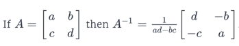
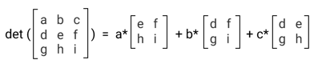

== Matrix Algebra

 * Basic Matrix Operations
   ** Matrix 는 하나 또는 그 이상의 열벡터를 포함한다.
   ** 동일한 수의 행과 열을 가진 벡터끼리 더하기나 빼기에 대한 연산이 가능함
   ** 하나의 행렬에 스칼라를 곱하는 연산이 가능함
 * Matrix Vector Multiplication
   ** 행렬과 벡터의 곱 연산을 위해서는 행렬의 열 갯수와 벡터의 행갯수가 동일해야 함
   ** numpy 를 이용한 행렬과 벡터의 곱연산 예
 * Matrix Multiplication
   ** 행렬(row * column) 곱의 경우 앞행렬의 column 과 뒤행렬의 row 의 숫자가 같아야 함
 * Matrix Transpose
   ** 행렬의 전치 : 전치의 전치는 원래 행렬과 같다.
   ** 회전 개념
   ** image:https://upload.wikimedia.org/wikipedia/commons/e/e4/Matrix_transpose.gif[]
   ** 전치행렬의 공식
      *** (A + B)T = AT + BT
      *** (A * B)T = BT * AT
 * Identity Matrix (단위행렬)
   ** 대각선이 1 이고 나머지가 0 인 행렬을 나타냄
   ** In 의 형식으로 표현함
   ** 단위행렬의 성질 : 단위행렬에 어땐 행렬을 곱하는 경우 그 자신과 같다.
 * Matrix Inverse
   ** 계수행렬을 연산하여 단위행렬로 만드는 방법에 대한 학습
   ** 어떤 행렬에 역행렬을 곱하면 단위행렬로 만들 수 있음
   ** determine or determinant : 행렬식, det(A) |A|
   ** 
   ** 행렬식이 0이 아닌지 여부는 연립방정식이 유일한 해를 갖는지를 결정
 * Solving The Matrix Equation
   ** 행렬 방정식을 푸는 방법에 대한 학습
 * Determinant For Higher Dimensions
   ** 좀 더 고차원의 행렬 방정식을 풀기 위한 행렬식 정의 방법 학습
   ** 고차원 행렬을 더 작은 행렬로 분리
   ** 
 * Matrix Inverse For Higher Dimensions
   ** 이전장에서 배운 행렬식을 이용하여 역행렬을 구하는 방법을 학습
   ** image:https://s3.amazonaws.com/dq-content/162/3d_matrix_inverse.svg[]
 * 참고
   ** http://judis.me/wordpress/2015/10/10/%EC%84%A0%ED%98%95%EB%8C%80%EC%88%98-note-18-properties-of-determinants/
   ** http://judis.me/wordpress/2015/10/12/%EC%84%A0%ED%98%95%EB%8C%80%EC%88%98-note-19-determinant-formulas-and-cofactors/
== 활용 주요 function
 * 라이브러리 사용 선언
   ** import numpy as np
 * function
   ** np.dot : 인자-matrix1, matrix2, 내적을 구하는 함수
   ** np.transpose : 인자-matrix, 전치행렬을 만드는 함수
   ** np.identity : 인자-n, 대각선이 1이고 나머지가 0인 단위행렬을 생성해 줌
   ** numpy.linalg.inv() : 인자-inverse 할 행렬
      *** 참고 : https://docs.scipy.org/doc/numpy/reference/generated/numpy.linalg.inv.html
   ** numpy.linalg.det() : 인자-행렬식을 구하고자 하는 행렬
