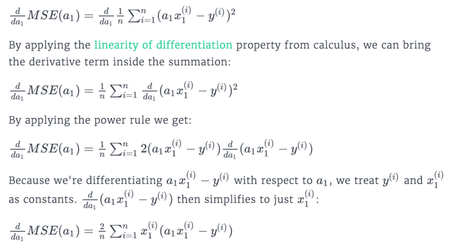
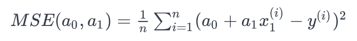

== Gradient Descent (경사하강법)
 * 경사하강법은 1차 근사값 발견용 최적화 알고리즘으로 기본 아이디어는 함수의 기울기(경사)를 구하여 기울기가 낮은 쪽으로 계속 이동시켜서 극값에 이를때까지 반복하는 방법

 * Introduction
   ** 이전장에서 Feature 선택 방식에 대한 학습을 진행
   ** 이번장과 다음장에서는 최적의 매개변수를 찾기 위한 방법에 대한 학습을 진행함

 * Single Variable Gradient Descent
   ** 곡선의 도함수를 이용하여 0 이 되는 임계점을 구함
   ** Gradient Descent
      *** 평균 제곱 오류가 가장 낮은 모델이 발견 될 때까지 다른 매개 변수 값을 반복적으로 시도
      *** 신경망과 같은 다른 모델에도 일반적으로 사용되는 최적화 기술임
   ** 적절한 Initial Value 과 Learning Rate 는 최적해를 찾는 반복 횟수를 줄여주며, 하이퍼파라미터 최적화의 부분이 됨
   ** Program 에서의 = 기호와 수학적 기호 =, ← 차이점 학습

 * Derivative Of The Cost Function
   ** 손실함수 : 수학적 최적화시 최소화를 통해 최적화하는 함수를 비용함수 또는 손실함수라 함
   ** a1 을 learning rate 만큼씩 변경하면서 반복
   ** 

 * Understanding Multi Parameter Gradient Descent
   ** linear regression model : SalePrice = a1 ∗ Gr Liv Area + a0
      *** a0 on the x-axis
      *** a1 on the y-axis
      *** MSE on the z-axis

 * Gradient Of The Cost Function
   ** MSE(a1) 에 대한 학습 후 MSE(a0, a1) 에 대한 처리에 대한 학습
   ** 

 * Grandient Descent For Higher Dimensions
   ** 각 매개 변수 값에는 자체 업데이트 규칙이 필요
   ** 이전에서 살펴본 a1의 업데이트 규칙과 거의 동일함

 * Next Steps
   ** 이후 미션에서는 매개 변수 또는 하이퍼 매개 변수 값 선택이 필요하지 않은 OLS 기법 학습

== 활용 주요 function
 * function
   ** for x in range(0, 10): 0 <= x < 10
